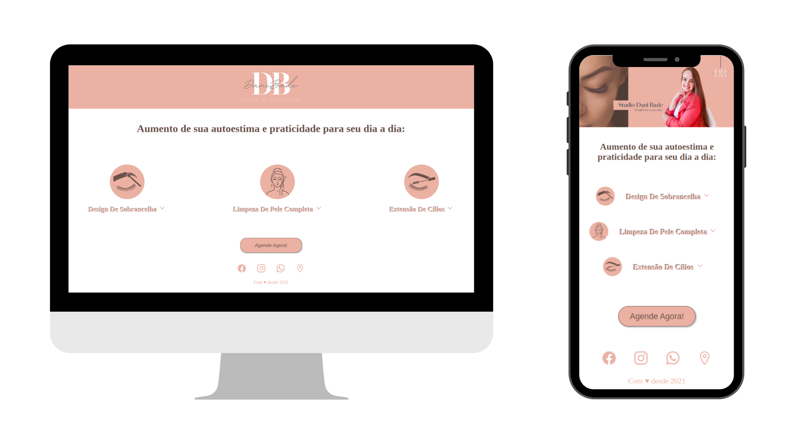
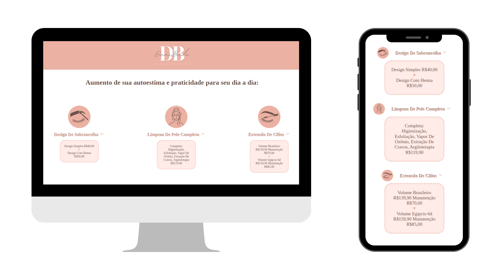

## Studio Dani Bade - Procedimentos Estéticos

Este é um projeto de página web desenvolvido para o Studio Dani Bade, apresentando seus procedimentos estéticos e serviços oferecidos. A página inclui informações sobre os procedimentos, preços e formas de contato.

### Funcionalidades

- **Design Responsivo:** A página é projetada para se adaptar a diferentes dispositivos e tamanhos de tela, garantindo uma experiência consistente para os usuários.
- **Interatividade:** Os usuários podem clicar nos diferentes serviços para expandir e visualizar mais informações sobre eles.
- **Agendamento fácil:** Botões de ação estão disponíveis para facilitar o agendamento dos serviços, com links diretos para o WhatsApp e redes sociais do Studio Dani Bade.
- **Facilidade de navegação:** A página é organizada de forma clara e intuitiva, permitindo que os usuários encontrem facilmente as informações desejadas.

### Como visualizar

Você pode visualizar a aplicação online [aqui](https://gabrielabade.github.io/studio-dani-bade/).

### Tecnologias utilizadas

- HTML5
- CSS3
- JavaScript

